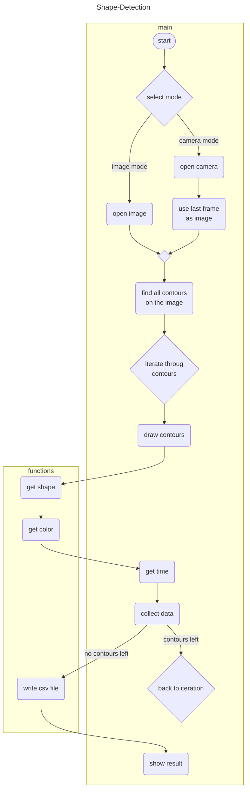

## Inhaltsverzeichnis

- [Einleitung](#einleitung)
- [Programm](#Programm)
	- [Main](#main)
	- [Funktionen](#funktionen)
		- [init_cam](#init_cam)
		- [get_color](#get_color)
		- [get_shape](#get_shape)
		- [get_contour_center](#get_contour_center)
		- [write_csv_file](#write_csv_file)
- [Bedienung](#Bedienung)
- [Fazit](#Fazit)


## Einleitung

Für das Modul Software-Engineering soll eine Python-Applikation entwickelt werden. Diese Applikation soll auf einem Bild verschiedene geometrische Formen und deren Farbe erkennen. Die erkannten Formen sollen auf dem Bild markiert und angeschrieben. Zusätzlich sollen die so erhaltenen Daten in einer .csv Datei abgespeichert werden.

Das dazu verwendete Bild soll entweder ein bereits existierendes Bild sein oder es soll mit dem live Bild einer Kamera erstellt werden.

Folgende Punkte müssen erfüllt sein:
- Formerkennung: Verschiedene geometrische Formen sollen erkannt und markiert werden (Kreise, Rechtecke, Quadrate und Dreiecke).
- Farberkennung: Die verschiedenen Farben der erkannten Formen sollen jeweils bestimmt werden (rot, grün, blau, gelb, violett).
- Echtzeit Visualisierung: Erkennung auf einer Live-Aufnahme von einer Webcam
- Daten-Protokoll: Protokollierung von Zeit, Farbe, Form und andere wichtige Informationen in einer .csv Datei

Folgende Punkte sind optional für die Implementierung:
- ROI (Region of Interest) mit der Maus aus wählbarer Bildbereich
- Pfadauswahl für das Protokoll
- Akustische Form- und Farbausgabe
- Applikationskonfiguration mit einer .conf Datei
## Programm
Für die Funktion des Programmes wird ein Bild benötigt. Dazu wird standartmässig ein bereits vorhandenes Bild eingelesen. Der Speicherort des Bildes kann in der Variabel __img_path__ angepasst werden. Alternativ kann der Kamera Modus gewählt werden. Dazu muss die Variabel __MODE__ zu "cam" angepasst werden. Im Kamera Modus wird ein live Bild und ein live binär Bild der gewählten Kamera angezeigt. Mit der Taste "Q" kann das live Bild beendet werden und das Programm läuft weiter. Hierbei wird das letzte Bild der Kamera gespeichert und für das restliche Programm verwendet. Hier ist zu beachten, dass auf dem binär Bild nur die zu erkennenden Formen weiss sind. Andernfalls kann dies zu Problemen bei der späteren Erkennung der Formen führen. Für ein besseres Ergebnis empfiehlt es sich hier die Kamera Einstellungen anzupassen. Diese können mit der Taste "S" geöffnet werden.

Auf dem erhaltenen Bild werden nun Konturen gesucht und gespeichert. Die gefundenen Konturen werden grün umrandet und mit der jeweiligen Farbe und Form angeschrieben. Zu beachten ist, dass noch nicht alle Farben und Formen dem Programm bekannt sind. Deswegen werden Formen oder Farben die nicht erkannt wurden mit "unbekannt" angeschrieben. Das bearbeitete Bild wird anschliessend angezeigt.

Die gewonnen Informationen werden aufgelistet und in der log.csv Datei gespeichert. Folgende Informationen zu jeder gefundenen Form werden gespeichert: Datum und Zeit zu welcher die Form erkannt wurde, Geometrische Form, Farbe der Form.

### Main


### Funktionen

#### init_cam

``` Python
def init_cam(DEVICE_ID):
    if platform.system() == 'Windows':
        videoBackend = cv2.CAP_DSHOW
    else:
        videoBackend = cv2.CAP_ANY

    cap = cv2.VideoCapture(DEVICE_ID, videoBackend)

    if not cap.isOpened():
        print('ERROR: could not open webcam')
    return cap
```

Die Funktion __init_cam___ wird im Kamera Modus benötigt. Sie öffnet die ausgewählte Kamera von welcher später das live Bild angezeigt werden soll.

#### get_color
``` Python
def get_color(img, cX, cY):
    b, g, r = img[cY, cX+20];
    
    # Color detection (red, green, blue, yellow, violet, cyan, pink)
    if b>g and b>r:
        if g<200 and r<100:
            return "blue"
        elif g<=r:
            return "violet"
        else:
            return "cyan"
    elif g>b and g>r:
        return "green"
    elif r>b and r>g:
        if g<100 and b<100:
            return "red"
        elif g<=b:
            return "pink"
        else:
            return "yellow"
    else:
        return "unknown"
```

Der __get_color__ Funktion wird ein Bild und die Koordinaten für einen Punkt auf diesem übergeben. Die Funktion liest den BGR Wert an diesem Punkt aus und erkennt um was für eine Farbe es sich handelt. Die erkannte Farbe wird als String zurückgegeben. 
Zu beachten ist, dass das Programm nur einem Teil des Farbspektrums eine Farbe zuweisen kann. Dem restlichen Spektrum wird der Wert "unbekannt" zugewiesen. Dies kann jedoch noch erweitert werden.
#### get_shape

``` Python
def get_shape(img, cX, cY, cnt):
    shape_str = "unknown"
    approx = cv2.approxPolyDP(cnt, 0.01*cv2.arcLength(cnt, True), True)
    
    # Find the shape depending on the amount of found edges
    if len(approx) > 15:
        shape_str = "circle"
    elif len(approx)==4:
        # Check if its a square or a rectangle
        if len(approx) == 4:
            x, y, w, h = cv2.boundingRect(approx)
            size = max(w, h)
            ratio = float(w)/h
            if ratio >= 0.9 and ratio <= 1.1:
                shape_str = "square"
            else:
                shape_str = "rectangle"
    elif len(approx)==3:
        shape_str = "triangle"
        
    return shape_str
```

Die __get_shape___ Funktion erkennt die geometrische Form einer Kontur anhand der Ecken Anzahl. Um Rechtecke und Quadrate zu unterscheiden werden zwei Seitenlängen verglichen. Die Funktion kann aber nicht feststellen ob die Ecken rechtwinklig sind. Somit könnte eine Form fälschlicher weise als Rechteck erkannt werden. Die Funktion gibt den Namen der erkannten geometrischen Form zurück. Falls eine Kontur nicht zugewiesen werden kann, wird der "unbekannt" zurück gegeben.

#### get_contour_center

``` Python
def get_contour_center(cnt):
    # Compute the center of the contour
    M = cv2.moments(cnt)
    
    try:
        cX = int(M["m10"] / M["m00"])
        cY = int(M["m01"] / M["m00"])
    except ZeroDivisionError:
        print("Cant devide by zero.")
    except:
        print("Cant compute the center of the contour.")

    return cX, cY
```

Mit der Funktion __get_contour_center__ wird der Schwerpunkt einer Kontur ermittelt und zurückgegeben. Für den Fall, dass eine zu kleine Kontur erkannt wurde, wurde ein try-except implementiert. Ansonsten könnte das Programm abhängig vom verwendeten Bild mal funktionieren und mal nicht.

#### write_csv_file

``` Python
def write_csv_file(csv_file, csv_data):
    try:
        with open(csv_file, 'w', encoding='UTF8') as file:
            writer = csv.writer(file)
            counter = 0
            for i in csv_data:
                writer.writerow(csv_data[counter])
                counter = counter+1
    except:
        print("Cant write to the .csv file!")
```

Die __write_csv_file__ Funktion beschreibt eine CSV Datei mit den mitgegebenen Daten.

## Bedienung

Vor dem ausführen des Programmes:
	- Aktuellste Version von GitHub heruntergeladen.
	- Modus Wählen (Bild oder Kamera). Dazu die entsprechende Variable im Code anpassen.
		- Im Bild Modus den Pfad zum gewünschten Bild anpassen.
		- Im Kamera Modus die ID des Gewünschten Gerätes anpassen.

Während dem ausführen:
	- Im Bild Modus wird das eingelesene Bild angezeigt. Um fortzufahren, beliebige Taste drücken.
	- Im Kamera Modus kann mit der Taste "S" die Einstellungen geöffnet werden und mit "Q" kann das live Bild beendet werden.
	- Wenn das Resultat Bild angezeigt wird, kann das Programm mit dem drücken einer beliebigen Taste beendet werden.

## Fazit
Die Soll-Kriterien wurden grösstenteils implementiert. Lediglich die Echtzeit Visualisierung konnte noch nicht zufriedenstellend implementiert werden. Die Erkennung funktioniert nicht direkt auf dem live Bild und die Erkennung, auf dem von der Kamera erhaltenen Bild, funktioniert nicht sehr zuverlässig. Hier müsste das live Bild noch besser vor verarbeitet werden, damit die Konturen besser erkannt werden können.

Im Bild Modus werden die Formen und Farben sehr gut erkannt. Auch das abspeichern der Daten in eine CSV Datei funktioniert sehr gut.

Die Formerkennung funktioniert gut. Da sie aber sehr simpel aufgebaut ist, kann es sein, dass z.B. ein Trapez als Rechteck erkannt wird. 


